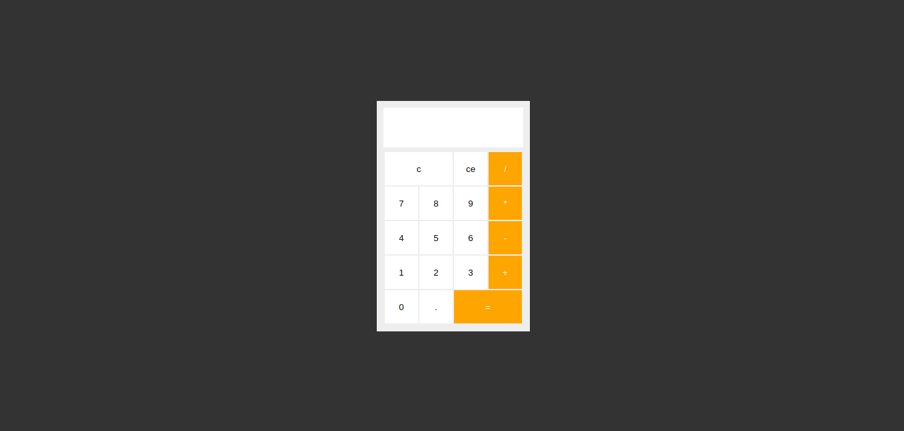

# Calculadora
Este é um simples projeto com a finalidade de treinar habilidades relativa as linguagens **JavaScript**, **HTML** e **CSS**. O projeto consiste em uma calculadora com as funcionalidades básicas. Qualquer sugestão de melhoria de código será muito bem-vinda :)

## Layout


## Linguagens
* JavaScript
* HTML
* CSS

## Executar
**Para executar este projeto na sua máquina, siga as instruções:**
* execute o seguinte comando no seu terminal: 
```$ git clone https://github.com/dhayananascimento/calculadora.git```
* abra a pasta que será  criada
* abra o arquivo "index.html" com o navegador de sua preferência
